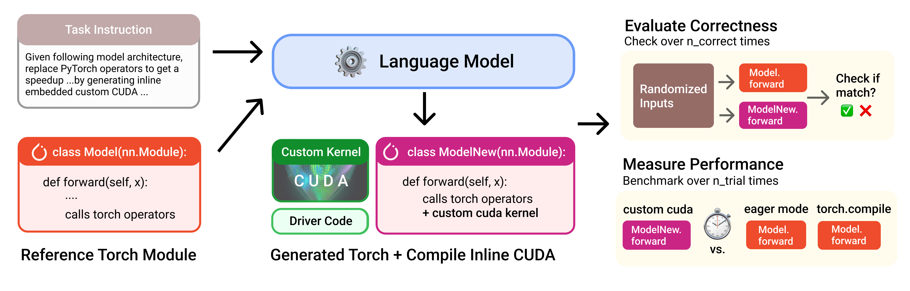

# KBenchEval (KernelBench)

**KBenchEval** is a comprehensive benchmark suite for evaluating Large Language Models' ability to generate efficient GPU kernels. The framework supports both CUDA and Triton kernel generation, with evaluation capabilities for correctness and performance across NVIDIA and AMD GPUs.

[arXiv](https://arxiv.org/html/2502.10517v1) | [blog post](https://scalingintelligence.stanford.edu/blogs/kernelbench/) | [HuggingFace Dataset](https://huggingface.co/datasets/ScalingIntelligence/KernelBench)


## 🙏 Acknowledgments

Special thanks to **[Meta AI](https://ai.meta.com/)** and the **Project Popcorn** team for their significant contribution in adding **Triton backend support** to KernelBench evaluation, enabling LLMs to generate and evaluate Triton kernels alongside CUDA kernels. This addition has been instrumental in advancing the field of automated kernel generation.

## 👋 Task Description

We structure the problem for LLMs to transpile operators described in PyTorch to GPU kernels (CUDA or Triton), at whatever level of granularity desired.



### Benchmark Levels

- **Level 1 🧱**: Single-kernel operators (100 Problems)
  - Foundational building blocks: Convolutions, Matrix multiplies, Layer normalization
- **Level 2 🔗**: Simple fusion patterns (100 Problems)
  - Fused kernels for better performance: Conv + Bias + ReLU, Matmul + Scale + Sigmoid
- **Level 3 ⚛️**: Full model architectures (50 Problems)
  - End-to-end optimization: MobileNet, VGG, MiniGPT, Mamba
- **Level 4 🤗**: HuggingFace models
  - Optimize whole model architectures from HuggingFace

## 🔧 Setup

### Prerequisites

- Python 3.10+
- CUDA Toolkit 11.8+ (NVIDIA) or ROCm 5.7+ (AMD)
- PyTorch with GPU support
- At least 16GB GPU memory

### Installation

<details>
<summary><b>📗 NVIDIA Environment</b></summary>

#### 1. Launch Docker Container (Recommended)

```bash
docker pull zhuzilin/slime:20250706-v2

docker run --rm --gpus all --ipc=host --shm-size=128g \
  --ulimit memlock=-1 --ulimit stack=67108864 \
  -v $HOME:$HOME \
  -it zhuzilin/slime:20250706-v2 /bin/bash
```

#### 2. Clone and Setup

```bash
# Clone repository
git clone https://github.com/RLsys-Foundation/TritonForge/KBenchEval.git
cd KBenchEval

# Create virtual environment (recommended for NVIDIA setup)
python -m venv .venv
source .venv/bin/activate

# Install dependencies
pip install --upgrade pip
pip install -r requirements.txt
pip install -e .
```

#### 3. Set API Keys (if using LLM APIs)

```bash
export OPENAI_API_KEY="your-key"
export ANTHROPIC_API_KEY="your-key"
export DEEPSEEK_API_KEY="your-key"
```

#### 4. Verify Installation

```bash
# Test single problem evaluation
python scripts/generate_and_eval_single_sample.py \
  dataset_src="huggingface" \
  level=1 \
  problem_id=0 \
  verbose_logging=true
```

</details>

<details>
<summary><b>📕 AMD Environment</b></summary>

#### 1. Allocate Compute Node (Azure)

```bash
tmux new-session -d -s kernel_agent_node_0

salloc --nodes=1 --exclusive --gres=gpu:8 \
          --time=120-00:00:00 \
          --nodelist=pdfc-aig-00001N \
          --job-name=Kernel-Agent
```

#### 2. Launch Docker Container

```bash
docker pull rlsys/april:slime_ubuntu22.04_rocm6.3.4-patch-numa_vllm0.8.5-patch_sglang0.4.7_megatron-core-patch_ray0.47-patch_apex_vim

docker run -it \
  --device /dev/dri \
  --device /dev/kfd \
  -p 8265:8265 \
  --group-add video \
  --cap-add SYS_PTRACE \
  --security-opt seccomp=unconfined \
  --privileged \
  -v $HOME/.ssh:/root/.ssh \
  -v $HOME:$HOME \
  --shm-size 128G \
  --name slime_dev \
  --ulimit memlock=-1 \
  --ulimit stack=67108864 \
  -w $PWD \
  rlsys/april:slime_ubuntu22.04_rocm6.3.4-patch-numa_vllm0.8.5-patch_sglang0.4.7_megatron-core-patch_ray0.47-patch_apex_vim \
  /bin/bash
```

#### 3. Clone AMD-Optimized Version

```bash
git clone git@github.com:SwordFaith/KernelBench.git KBenchEval
cd KBenchEval
git checkout AMD-ver
```

#### 4. Set Environment Variables

```bash
# AMD GPU configuration
export ROCM_HOME=/opt/rocm
export HIP_PLATFORM=amd
export PYTORCH_ROCM_ARCH=gfx942
export PATH=$ROCM_HOME/bin:$PATH
export LD_LIBRARY_PATH=$ROCM_HOME/lib:$LD_LIBRARY_PATH
export SGLANG_API_KEY=local-key
export PYTHONPATH=/workspace/KBenchEval:$PYTHONPATH

# AMD optimizations
export HSA_ENABLE_SDMA=0

# Prevent GPU core dumps
export HSA_ENABLE_COREDUMP=0
export AMD_LOG_LEVEL=0
export ROCM_DISABLE_CRASH_DUMP=1
export HIP_ENABLE_COREDUMP=0
export HSA_TOOLS_LIB=/opt/rocm/lib/librocm-debug-agent.so.2:0
export GPU_MAX_HW_QUEUES=1
```

#### 5. Install Dependencies

```bash
# Install additional AMD-specific dependencies
pip install pydra_config==0.0.15
cd /usr/local/lib/python3.12/dist-packages && ln -sf pydra_config pydra
cd -

pip install together google-generativeai
pip install -r requirements.txt
pip install -e .
```

#### 6. Verify Installation

```bash
# Test AMD GPU detection
python tests/test_amd_mi300x.py

# Test single problem evaluation
export OPENAI_API_KEY="dummy-key"
python scripts/generate_and_eval_single_sample.py \
  dataset_src=local \
  level=1 \
  problem_id=19 \
  gpu_arch='["MI300X"]' \
  backend=triton \
  server_type=sglang \
  eval_device=0 \
  verbose=True
```

</details>

## ⚖️ Evaluation

### Methodology

To evaluate model-generated kernels, we check if they:
- **Are correct ✅**: Check against reference PyTorch operators `n_correctness` times on randomized inputs
- **Are performant ⏱️**: Compare against reference operators `n_trial` times to measure speedup

Check out `src/eval.py` for implementation details.

### Benchmark Metrics

We use the metric `fast_p`: fraction of tasks that are both correct and have a speedup greater than threshold `p`.

- **fast_0**: Fraction of kernels that are **correct** (correctness rate)
- **fast_1**: Fraction that are correct AND **faster** than PyTorch
- **fast_2**: Fraction that are correct AND **at least 2x faster**

## 🚀 Usage

### Single Problem Evaluation

<details>
<summary><b>NVIDIA</b></summary>

```bash
cd KBenchEval
source .venv/bin/activate  # If using virtual environment

# Run level 2, problem 40
python scripts/generate_and_eval_single_sample.py \
  dataset_src="huggingface" \
  level=2 \
  problem_id=40 \
  verbose_logging=true
```

</details>

<details>
<summary><b>AMD</b></summary>

```bash
cd KBenchEval

python scripts/generate_and_eval_single_sample.py \
  dataset_src=local \
  level=2 \
  problem_id=40 \
  gpu_arch='["MI300X"]' \
  backend=triton \
  server_type=sglang \
  eval_device=0 \
  verbose=True
```

</details>

### Batch Evaluation

<details>
<summary><b>NVIDIA</b></summary>

```bash
# 1. Generate responses for all Level 1 problems
python scripts/generate_samples.py \
  run_name=nvidia_test_level1 \
  dataset_src=huggingface \
  level=1 \
  num_workers=50 \
  server_type=deepseek \
  model_name=deepseek-chat \
  temperature=0

# 2. Evaluate generated kernels
python scripts/eval_from_generations.py \
  run_name=nvidia_test_level1 \
  dataset_src=local \
  level=1 \
  num_gpu_devices=8 \
  timeout=300

# Optional: Build compilation cache first for speedup
python scripts/eval_from_generations.py \
  run_name=nvidia_test_level1 \
  dataset_src=local \
  level=1 \
  num_gpu_devices=8 \
  timeout=300 \
  build_cache=True \
  num_cpu_workers=32

# 3. Analyze results
python scripts/benchmark_eval_analysis.py \
  run_name=nvidia_test_level1 \
  level=1 \
  hardware=A100 \
  baseline=baseline_time_torch
```

</details>

<details>
<summary><b>AMD</b></summary>

```bash
# Terminal 1: Launch SGLang server for model inference
HIP_VISIBLE_DEVICES=2,3 python3 -m sglang.launch_server \
  --model-path models/Qwen3-8B-Kernelbook-SFT-HF \
  --tp 2 \
  --trust-remote-code \
  --host 0.0.0.0 \
  --port 30000

# Terminal 2: Run comprehensive evaluation
cd KBenchEval
python kernelbench_amd_tools/scripts/run_qwen3_evaluation_robust.py \
  --levels 1,2
```

</details>

### Evaluation Server

For handling resource-intensive Triton kernels:

```bash
# Standard evaluation server
python scripts/simple_eval_server.py

# Server with CUDA memory fixes (for problematic Triton kernels)
python scripts/simple_eval_server_cuda_fix.py
```

## 🔍 Directory Structure

```
KBenchEval/
├── assets/                         # Figures and documentation assets
├── KernelBench/                    # Benchmark dataset files
│   ├── level1/                     # Single operators (100 problems)
│   ├── level2/                     # Fusion patterns (100 problems)
│   └── level3/                     # Full models (50 problems)
├── src/                            # Core evaluation logic
│   ├── eval.py                     # Correctness and performance evaluation
│   ├── dataset.py                  # Dataset loading and management
│   ├── compile.py                  # Kernel compilation
│   ├── prompt_constructor*.py      # LLM prompt templates
│   └── amd_profiling.py           # AMD GPU support
├── scripts/                        # Evaluation and analysis scripts
│   ├── generate_and_eval_single_sample.py  # Single problem testing
│   ├── eval_from_generations.py            # Batch evaluation
│   ├── benchmark_eval_analysis.py          # Performance analysis
│   └── simple_eval_server*.py              # Evaluation servers
├── kernelbench_amd_tools/          # AMD-specific utilities
│   └── scripts/                    # AMD evaluation scripts
├── SFT_data_pipeline/              # Supervised fine-tuning data generation
│   ├── mutli-turn-data-pipeline/  # Multi-turn conversation generation
│   ├── thinking-filtering-data-pipeline/  # Thinking tags & filtering
│   └── assets/                    # Training visualizations
├── results/                        # Baseline times across hardware
├── runs/                           # Generated kernels and evaluations
└── tests/                          # Unit tests
```

## 🛠️ Advanced Features

### Performance Baselines

We provide reference baseline times for various GPUs in `results/timing/`:

#### Available Baselines

<div align="center">

| Hardware | Platform | Level 1 | Level 2 | Total Problems |
|----------|----------|---------|---------|----------------|
| **MI300X_rocm** | AMD ROCm | ✅ 100 | ✅ 100 | 200 |
| **H100_together** | NVIDIA CUDA | ✅ 100 | ✅ 100 | 200 |
| **A100_modal** | NVIDIA CUDA | ✅ 100 | ✅ 100 | 200 |
| **L40S_modal** | NVIDIA CUDA | ✅ 100 | ✅ 100 | 200 |
| **B200_together** | NVIDIA CUDA | ✅ 100 | ✅ 100 | 200 |

</div>

#### Generate Your Own Baselines

**For AMD MI300X:**
```bash
# Complete baseline generation script for AMD GPUs
bash scripts/run_amd_baseline_generation.sh

# Or manually:
python scripts/generate_baseline_time_amd.py \
  --level 1 2 \
  --hardware MI300X_rocm
```

**For NVIDIA GPUs:**
```bash
python scripts/generate_baseline_time.py \
  level=1 \
  hardware_name="H100" \
  num_runs=100
```

We recommend generating your own baselines for accuracy on your specific hardware configuration.

### Multi-Turn Framework

For iterative refinement experiments, check out [Caesar](https://github.com/simonguozirui/caesar) - a test-time framework for high-throughput sequential and parallel refinement targeting KernelBench problems.

### Modal Support

If you don't have local GPU access, set up [Modal](https://modal.com/):

```bash
modal token new
python scripts/generate_and_eval_single_sample_modal.py \
  dataset_src="huggingface" \
  level=1 \
  problem_id=0
```

## 🐛 Troubleshooting

### Known Issues on AMD

Some problems may cause GPU crashes on AMD MI300X:
- Level 1, Problem 42: Max_Pooling_2D
- Level 2, Problem 7: Conv3d_ReLU_LeakyReLU_GELU_Sigmoid_BiasAdd

Ensure environment variables are properly set to prevent core dumps.

### CUDA Memory Issues

For Triton kernels with shared memory issues, use:
```bash
python scripts/simple_eval_server_cuda_fix.py
```

## 🔬 Results

### Fine-tuned Model Performance

We evaluated our SFT fine-tuned Qwen3-8B model on KernelBench Level 1-2:

<div align="center">

| Model | Level 1 Pass@1 | Level 2 Pass@1 | Training Data | Notes |
|-------|----------------|----------------|---------------|--------|
| **Qwen3-8B-Kernelbook-SFT** | 18% | 8% | 17k filtered samples | Close to KernelBook baseline (20%) |
| **KernelBook Baseline** | 20% | - | Original dataset | Reference performance |

</div>

The model demonstrates strong performance on Level 1 problems, achieving results close to the KernelBook baseline. This validates our SFT data pipeline's effectiveness in creating high-quality training data.

**Model Checkpoint**: [JinnP/Qwen3-8B-Kernelbook-SFT-filtered](https://huggingface.co/JinnP/Qwen3-8B-Kernelbook-SFT-filtered)

## 🛣️ Roadmap

- [x] Triton Variant (Thanks to Meta AI!)
- [ ] Easy-to-use CoLab Notebook Example
- [ ] Push-button flow on Modal/Cloud Provider
- [ ] Integration with ThunderKittens
- [ ] Backward pass support
- [ ] NCU toolchain integration

## 🔍 Known Usage & Related Work

- [NVIDIA](https://developer.nvidia.com/blog/automating-gpu-kernel-generation-with-deepseek-r1-and-inference-time-scaling/) - Automating GPU Kernel Generation
- [METR](https://metr.org/blog/2025-02-14-measuring-automated-kernel-engineering/) - Measuring Automated Kernel Engineering
- [Sakana AI](https://sakana.ai/ai-cuda-engineer/) - AI Cuda Engineer
- [Project Popcorn](https://www.youtube.com/watch?v=mdDVkBeFy9A) - Triton Support for KernelBench
- [Kevin](https://cognition.ai/blog/kevin-32b) - Kevin-32B: Multi-Turn RL for Writing CUDA Kernels ([Paper](https://arxiv.org/abs/2507.11948))
- [Simple Test-Time Search](https://scalingintelligence.stanford.edu/blogs/fastkernels/) - by @anneouyang

## 📄 License

MIT - See LICENSE file for details

## 📚 Citation

```bibtex
@misc{ouyang2025kernelbenchllmswriteefficient,
      title={KernelBench: Can LLMs Write Efficient GPU Kernels?}, 
      author={Anne Ouyang and Simon Guo and Simran Arora and Alex L. Zhang and William Hu and Christopher Ré and Azalia Mirhoseini},
      year={2025},
      eprint={2502.10517},
      archivePrefix={arXiv},
      primaryClass={cs.LG},
      url={https://arxiv.org/abs/2502.10517}, 
}
```

## 📧 Contact

For questions about KBenchEval:
- Issue Tracker: [GitHub Issues](https://github.com/RLsys-Foundation/KBenchEval/issues)
- Original KernelBench: [ScalingIntelligence/KernelBench](https://github.com/ScalingIntelligence/KernelBench)