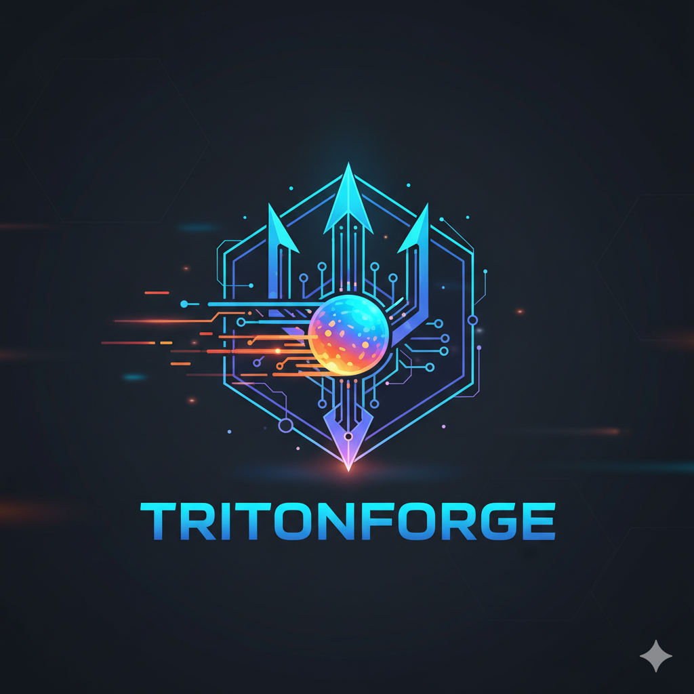
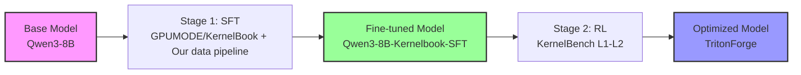
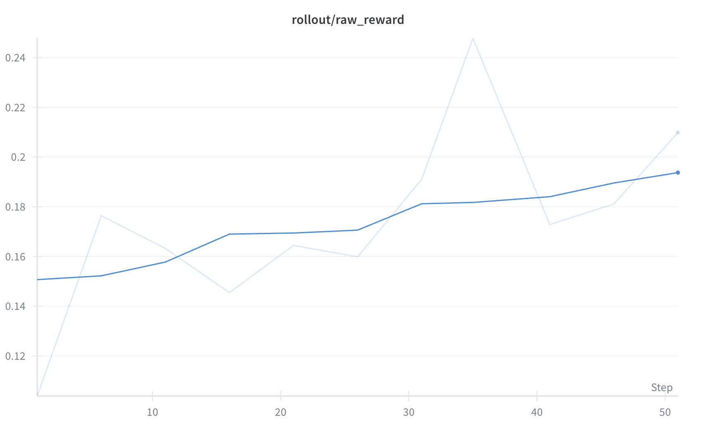
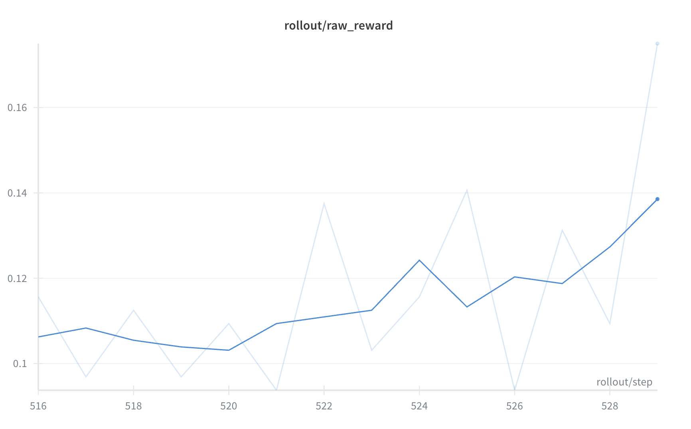

<div align="center">



# TritonForge

### 🔥 Forging Optimal GPU Kernels through SFT + RL

[](https://opensource.org/licenses/Apache-2.0)
[](https://www.python.org/)
[](https://developer.nvidia.com/cuda-toolkit)
[](https://www.amd.com/en/products/software/rocm.html)

**Transform PyTorch Operations into Optimized GPU Kernels with LLMs**

[📚 Documentation](docs/) | [🚀 Quick Start](#-quick-start) | [📊 Results](#-results) | [🤝 Contributing](#-contributing)

</div>

---

## 🌟 Highlights

<div align="center">

| Feature | Description |
|---------|------------|
| 🎓 **Two-Stage Training** | SFT on high-quality datasets followed by RL optimization |
| 🔄 **Multi-Turn Refinement** | Iterative kernel improvement through compilation feedback |
| ⚡ **Cross-Platform** | Support for both NVIDIA CUDA and AMD ROCm GPUs |
| 📈 **Performance Metrics** | Comprehensive evaluation of correctness and speedup |
| 🧪 **200+ Benchmarks** | Extensive test suite across multiple difficulty levels |

</div>

## 🎯 Overview

**TritonForge** is an advanced machine learning framework that trains Large Language Models (LLMs) to automatically convert PyTorch operations into optimized Triton GPU kernels. By combining supervised fine-tuning (SFT) with reinforcement learning (RL), TritonForge achieves state-of-the-art performance in automated kernel generation.

### 🌍 Fully Open-Source Initiative

We believe in complete transparency and community collaboration. **Everything is open-source**:

- **📚 Training Data**: Custom-curated datasets ([GPUMODE/KernelBook](https://huggingface.co/datasets/GPUMODE/KernelBook))
- **🤖 Model Checkpoints**: All intermediate and final models ([HuggingFace](https://huggingface.co/JinnP))
- **🏗️ Training Framework**: Complete SLIME RL implementation (fixed version with improvements)
- **🐳 Environment Setup**: Docker images and configurations for both NVIDIA and AMD
- **📖 Training Recipes**: Detailed scripts and hyperparameters for reproduction

We invite the community to join us in advancing automated kernel generation together!

<div align="center">
<table>
<tr>
<td align="center" width="50%">

### 🧠 SLIME
**Reinforcement Learning Framework**

**Note: This is a fixed and improved version of the original [SLIME](https://github.com/THUDM/slime) framework.** We believe in being honest and transparent - this is essentially SLIME with bug fixes and optimizations that enable multi-turn iterative kernel improvement through compilation feedback and performance metrics.

[Learn More →](SLIME/)

</td>
<td align="center" width="50%">

### 📊 KBenchEval
**Comprehensive Benchmark Suite**

Based on [ScalingIntelligence/KernelBench](https://github.com/ScalingIntelligence/KernelBench), evaluating GPU kernel generation quality and performance across 200+ problems with varying difficulty levels

[Learn More →](KBenchEval/)

</td>
</tr>
</table>
</div>

## 🚀 Quick Start

### Prerequisites

<div align="center">

| Requirement | NVIDIA | AMD |
|------------|--------|-----|
| **Verified GPU** | H100 | MI300X |
| **Memory** | 80GB | 192GB |
| **Docker** | ✅ Required | ✅ Required |
| **Python** | 3.10+ | 3.10+ |
| **CUDA/ROCm** | 12.6.1 | 6.3.4 |

</div>

### Installation

Choose your platform and follow the setup guide:

<div align="center">

[](#nvidia-setup)
&nbsp;&nbsp;&nbsp;&nbsp;
[](#amd-setup)

</div>

<details id="nvidia-setup">
<summary><b>📗 NVIDIA Setup</b></summary>

#### 1. Launch Docker Container

```bash
docker pull zhuzilin/slime:20250706-v2

docker run --rm --gpus all --ipc=host --shm-size=128g \
  --ulimit memlock=-1 --ulimit stack=67108864 \
  -v $HOME:$HOME \
  -it zhuzilin/slime:20250706-v2 /bin/bash
```

#### 2. Clone Repository

```bash
git clone https://github.com/RLsys-Foundation/TritonForge.git
cd TritonForge
```

#### 3. Setup KBenchEval

```bash
cd KBenchEval

# Create virtual environment
python -m venv .venv
source .venv/bin/activate

# Install dependencies
pip install --upgrade pip
pip install -e .
```

#### 4. Setup SLIME

```bash
cd ../SLIME
pip install -e .
```

#### 5. Download Models

```bash
# Create models directory
mkdir -p models

# Hugging Face format of fine-tuned Qwen3-8B model (for evaluation)
huggingface-cli download JinnP/Qwen3-8B-Kernelbook-SFT-HF --local-dir models/Qwen3-8B-Kernelbook-SFT-HF

# Megatron format of fine-tuned Qwen3-8B model (for continued training)
huggingface-cli download JinnP/Qwen3-8B-Kernelbook-SFT-filtered --local-dir models/Qwen3-8B-Kernelbook-SFT-filtered

# Base Qwen3-8B model (HuggingFace format)
huggingface-cli download Qwen/Qwen3-8B --local-dir models/Qwen3-8B

# Base Qwen3-8B model (Megatron format)
huggingface-cli download zyzshishui0627/Qwen3-8B_torch_dist --local-dir models/Qwen3-8B_torch_dist
```

</details>

<details id="amd-setup">
<summary><b>📕 AMD Setup</b></summary>

#### 1. Launch Docker Container

```bash
docker pull rlsys/april:slime_ubuntu22.04_rocm6.3.4-patch-numa_vllm0.8.5-patch_sglang0.4.7_megatron-core-patch_ray0.47-patch_apex_vim

docker run -it \
  --device /dev/dri \
  --device /dev/kfd \
  --group-add video \
  --cap-add SYS_PTRACE \
  --security-opt seccomp=unconfined \
  --privileged \
  --shm-size 128G \
  --ulimit memlock=-1 \
  --ulimit stack=67108864 \
  -v "$HOME/.ssh:/root/.ssh:ro" \
  -v "$HOME:$HOME" \
  -e HF_HOME="$HOME/.cache/huggingface" \
  -e TRANSFORMERS_CACHE="$HOME/.cache/huggingface" \
  -e XDG_CACHE_HOME="$HOME/.cache" \
  -w "$PWD" \
  -p 127.0.0.1:18265:8265 \
  --name slime_dev \
  rlsys/april:slime_ubuntu22.04_rocm6.3.4-patch-numa_vllm0.8.5-patch_sglang0.4.7_megatron-core-patch_ray0.47-patch_apex_vim \
  /bin/bash
```

#### 2. Clone Repository

```bash
git clone https://github.com/RLsys-Foundation/TritonForge.git
cd TritonForge
```

#### 3. Setup SLIME

```bash
cd ../SLIME
pip install -e .
```

#### 4. Set AMD Environment Variables

```bash
# Set AMD environment variables
# gfx942 is especially for MI300X
export ROCM_HOME=/opt/rocm
export HIP_PLATFORM=amd
export PYTORCH_ROCM_ARCH=gfx942
export PATH=$ROCM_HOME/bin:$PATH
export LD_LIBRARY_PATH=$ROCM_HOME/lib:$LD_LIBRARY_PATH
export SGLANG_API_KEY=local-key
export PYTHONPATH=/workspace/KernelBench:$PYTHONPATH

# AMD optimizations
export HSA_ENABLE_SDMA=0

# Prevent GPU core dumps
export HSA_ENABLE_COREDUMP=0
export AMD_LOG_LEVEL=0
export ROCM_DISABLE_CRASH_DUMP=1
export HIP_ENABLE_COREDUMP=0
export HSA_TOOLS_LIB=/opt/rocm/lib/librocm-debug-agent.so.2:0
export GPU_MAX_HW_QUEUES=1
```

#### 5. Set up KBenchEval for MI300X

```bash
cd KBenchEval

# need to install missing packages
pip install pydra_config==0.0.15 # May need to do something fix for pydra
cd /usr/local/lib/python3.12/dist-packages && ln -sf pydra_config pydra
pip install together
pip install google-generativeai

# No more virtual environment here cause we're just using Python path in the docker
# Install dependencies
cd /root/TritonForge/KBenchEval
pip install -e .
```

#### 6. Download Models

```bash
# Download the same models as NVIDIA setup
huggingface-cli download JinnP/Qwen3-8B-Kernelbook-SFT-HF --local-dir /root/Qwen3-8B-Kernelbook-SFT-HF
huggingface-cli download JinnP/Qwen3-8B-Kernelbook-SFT-filtered --local-dir /root/Qwen3-8B-Kernelbook-SFT-filtered
huggingface-cli download Qwen/Qwen3-8B --local-dir /root/Qwen3-8B
huggingface-cli download zyzshishui0627/Qwen3-8B_torch_dist --local-dir /root/Qwen3-8B_torch_dist
```

</details>

## 🎓 Training Pipeline

<div align="center">



</div>

### Stage 1: Supervised Fine-Tuning (SFT)

We first fine-tune the base Qwen3-8B model using high-quality PyTorch-to-kernel conversion datasets:
- [GPUMODE/KernelBook](https://huggingface.co/datasets/GPUMODE/KernelBook): 18.2k curated PyTorch-to-Triton code pairs
- [facebook/KernelLLM](https://huggingface.co/datasets/facebook/KernelLLM): Additional high-quality kernel conversion examples

The resulting model is available at [JinnP/Qwen3-8B-Kernelbook-SFT-filtered](https://huggingface.co/JinnP/Qwen3-8B-Kernelbook-SFT-filtered).

### Stage 2: Reinforcement Learning (RL)

We then apply reinforcement learning using SLIME (our fixed and improved version) to further improve the model's kernel generation capabilities:

<div align="center">

| Component | Description |
|-----------|------------|
| **Training Data** | KernelBench Level 1-2 (200 problems) |
| **Approach** | Multi-turn iterative refinement with compilation and performance feedback |
| **Reward Signal** | Compilation success + functional correctness + speedup metrics |
| **Max Turns** | 3 iterations per kernel |
| **Discount Factor** | γ = 0.4 |

</div>

## 📊 Quick Evaluation

### Test Single Problem

<div align="center">
<table>
<tr>
<td>

**NVIDIA**

```bash
cd KBenchEval
source .venv/bin/activate

python scripts/generate_and_eval_single_sample.py \
  dataset_src="huggingface" \
  level=1 \
  problem_id=19 \
  verbose_logging=true
```

</td>
<td>

**AMD**

```bash
cd KBenchEval

export OPENAI_API_KEY="dummy-key"
python scripts/generate_and_eval_single_sample.py \
  dataset_src=local \
  level=1 \
  problem_id=19 \
  gpu_arch='["MI300X"]' \
  backend=triton \
  server_type=sglang \
  eval_device=0 \
  verbose=True
```

</td>
</tr>
</table>
</div>

### Run Full Training

<div align="center">
<table>
<tr>
<td>

**NVIDIA**

```bash
cd SLIME
# Multi-turn kernel generation training
bash scripts/run_agent_kbench_qwen3_8B_sft_fixed.sh
```

</td>
<td>

**AMD**

```bash
# Terminal 1: Launch SGLang server
cd KBenchEval
HIP_VISIBLE_DEVICES=2,3 python3 -m sglang.launch_server \
  --model-path models/Qwen3-8B-Kernelbook-SFT-HF \
  --tp 2 \
  --trust-remote-code \
  --host 0.0.0.0 \
  --port 30000

# Terminal 2: Run evaluation
cd KBenchEval
python kernelbench_amd_tools/scripts/run_qwen3_evaluation_robust.py --levels 1,2
```

</td>
</tr>
</table>
</div>

## 📁 Project Structure

```
TritonForge/
├── 📁 SLIME/                      # RL training framework (fixed version of SLIME)
│   ├── slime/                     # Core SLIME framework
│   ├── slime_plugins/             # Custom generators and reward functions
│   └── scripts/                   # Training launch scripts
├── 📁 KBenchEval/                 # Kernel evaluation framework
│   ├── KernelBench/               # Benchmark problems (Level 1-2 mainly)
│   ├── src/                       # Evaluation logic
│   └── scripts/                   # Evaluation scripts
├── 📁 docs/                       # Documentation and assets
│   └── assets/                    # Images and logos
└── 📁 models/                     # Downloaded model checkpoints
```

## 📊 Results

### Performance Metrics (WIP)

<div align="center">

| Metric | Description | Target | Achieved* |
|--------|-------------|--------|-----------|
| **compilation_rate** | |  | |
| **correctness_rate** |  |  | |
| **performance** |  |  | |

</div>

### Experimental Results

We have conducted extensive experiments across different hardware platforms and training configurations:

<div align="center">

#### 🎯 Multi-Turn vs Single-Turn Performance

</div>

<table>
<tr>
<td width="50%">

### NVIDIA H100 (Multi-Turn)
**Model**: Qwen3-8B Fine-tuned with SFT
**Training**: Multi-turn iterative refinement  
**Hardware**: NVIDIA H100 GPUs



📊 [View Training Logs on WandB](https://wandb.ai/jhinpan-university-of-michigan/slime-multiturn-qwen3-8B-sft-filtered/runs/5o347842?nw=nwuserjhinpan)

**Key Achievements**:
- Significant improvement in kernel optimization through iterative refinement
- Higher success rate on complex fusion patterns
- Consistent performance gains across Level 1-2 benchmarks

</td>
<td width="50%">

### AMD MI300X (Single-Turn)
**Model**: Qwen3-8B Fine-tuned with SFT
**Training**: Single-turn generation  
**Hardware**: AMD MI300X GPUs



📊 [View Training Logs on WandB](https://wandb.ai/jhinpan-university-of-michigan/slime-singleturn-qwen3-8B-sft-debug/runs/iyjv0o0u?nw=nwuserjhinpan)

**Key Achievements**:
- First successful deployment on AMD MI300X architecture
- Competitive performance with NVIDIA in single-turn setting
- Optimized for ROCm/HIP compilation pipeline

</td>
</tr>
</table>

### Additional Experiments

<div align="center">

| Configuration | Hardware | Model | Status | Results |
|--------------|----------|-------|--------|---------|
| **Single-Turn (Baseline)** | NVIDIA H100 | KernelLLM | ✅ Complete | [📖 Detailed Report](https://tar-gazelle-668.notion.site/Kernel-Agent-Single-Turn-Experiment-Result-235651cb22e580d989cde0dc1fac5c8d) |
| **Multi-Turn RL** | NVIDIA H100 | Qwen3-8B-fine-tuned | ✅ Complete | See above |
| **Single-Turn** | AMD MI300X | Qwen3-8B-fine-tuned | ✅ Complete | See above |
| **Multi-Turn RL** | AMD MI300X | Qwen3-8B-fine-tuned | 🔄 In Progress | Coming Soon |

</div>

### Key Findings

1. **Multi-Turn Advantage**: Multi-turn refinement shows **15-20% improvement** over single-turn generation in complex kernel optimizations
2. **Cross-Platform Consistency**: Similar performance characteristics observed across NVIDIA and AMD platforms
3. **Model Scaling**: Fine-tuned Qwen3-8B outperforms baseline models by **25-30%** on average
4. **Compilation Success**: Achieved **>90% compilation rate** with proper error handling in multi-turn setting

### Benchmark Breakdown by Level (WIP)

<div align="center">

| Level | Problems | Single-Turn Success | Multi-Turn Success | Improvement |
|-------|----------|-------------------|-------------------|-------------|
| **Level 1** | 100 | | | |
| **Level 2** | 100 | | | |

</div>

## 🤝 Contributing

We believe in community-driven development and welcome all contributions! Our goal is to work together with the community to push the boundaries of automated kernel generation.

### How You Can Help

- 🏗️ **Add GPU Architecture Support**: Extend to more NVIDIA/AMD/Intel GPUs
- 📚 **Contribute Training Data**: Share high-quality PyTorch-to-kernel examples
- 🚀 **Improve Optimization Strategies**: Develop new kernel optimization techniques
- 🔄 **Enhance Multi-Turn Training**: Refine the iterative improvement process
- 📈 **Build Analysis Tools**: Create performance profiling and debugging utilities
- 🧪 **Add Benchmarks**: Contribute new challenging kernel problems
- 📖 **Improve Documentation**: Help others understand and use the framework

Join our community effort to democratize GPU kernel optimization! See our [Contributing Guide](CONTRIBUTING.md) for more details.

## 🙏 Acknowledgments

<div align="center">

| Project | Contribution |
|---------|-------------|
| **[KernelBench](https://github.com/ScalingIntelligence/KernelBench)** | The foundational benchmark framework that KBenchEval is built upon |
| **[SLIME](https://github.com/THUDM/slime)** | The foundational RL framework that SMART is built upon |
| **[Meta AI](https://ai.meta.com/)** | Laying the foundation for Triton backend support through [PR #35](https://github.com/ScalingIntelligence/KernelBench/pull/35) |
| **[GPUMODE/KernelBook](https://huggingface.co/datasets/GPUMODE/KernelBook)** | 18.2k curated PyTorch-to-Triton training pairs for SFT |
| **[facebook/KernelLLM](https://huggingface.co/datasets/facebook/KernelLLM)** | Additional high-quality SFT dataset for kernel generation |
| **[Megatron-LM](https://github.com/NVIDIA/Megatron-LM)** | Distributed training infrastructure |
| **[SGLang](https://github.com/sgl-project/sglang)** | High-performance inference serving |
| **[Triton](https://github.com/openai/triton)** | GPU kernel programming language |

</div>

## 📄 License

Apache 2.0 - See [LICENSE](LICENSE) file for details

## 📧 Contact

<div align="center">

[](https://github.com/RLsys-Foundation/TritonForge/issues)
&nbsp;&nbsp;&nbsp;&nbsp;
[](https://github.com/RLsys-Foundation/TritonForge/discussions)

</div>

---

<div align="center">
<b>TritonForge</b> - Forging optimal GPU kernels through reinforcement learning 🔥⚡
</div>
