# TritonForge Architecture Overview

## 🏗️ Overall System Architecture

TritonForge is a **server-based SFT + RL post-training framework** that operates across both AMD and NVIDIA platforms, featuring complete disaggregation of training, inference, and evaluation components.


## 🔄 Training Pipeline Flow

### Stage 1: SFT Data Generation Pipeline

```mermaid
flowchart LR
    subgraph RDS["Raw Data Sources"]
        KB["KernelBook<br/>18.2k samples"]
        KBench["KernelBench<br/>L1-L4 problems"]
    end

    subgraph DA["Data Augmentation"]
        MT[Multi-Turn Converter]
        TT["Thinking Tags<br/>⟨thinking⟩...⟨/thinking⟩"]
        Conv[Conversation Format]

        KB --> MT
        KBench --> MT
        MT --> TT
        TT --> Conv
    end

    subgraph QC["Quality Control"]
        LenFilter["Length Filter<br/>Min: 100 tokens<br/>Max: 8192 tokens"]
        QualFilter["Quality Filter<br/>Remove invalid code"]
        Dedup[Deduplication]

        Conv --> LenFilter
        LenFilter --> QualFilter
        QualFilter --> Dedup
    end

    subgraph OF["Output Formats"]
        JSONL["JSONL Format<br/>kernel_bench_triton_all_levels.jsonl"]
        Megatron["Megatron Format<br/>For distributed training"]

        Dedup --> JSONL
        Dedup --> Megatron
    end

    JSONL --> FinalData[17k Filtered Samples]
    Megatron --> FinalData
```



### Stage 2: Server-Based Training Architecture


## 🚀 Multi-Turn Refinement Process


## 🖥️ Platform-Specific Implementations

### NVIDIA H100 Configuration

```yaml
Hardware:
  GPU: H100 80GB
  CUDA: 12.6.1
  Triton: 3.0+

Training Config:
  Tensor Parallel: 2
  Context Parallel: 4
  Pipeline Parallel: 1
  Batch Size: 32
  Learning Rate: 1e-5

Evaluation:
  Backend: CUDA + Triton JIT
  Profiling: NSight Systems
  Metrics: FLOPS, Memory Bandwidth
```

### AMD MI300X Configuration

```yaml
Hardware:
  GPU: MI300X 192GB
  ROCm: 6.3.4
  HIP: 6.3+

Training Config:
  Tensor Parallel: 2
  Context Parallel: 4
  Pipeline Parallel: 1
  Batch Size: 32
  Learning Rate: 1e-5

Evaluation:
  Backend: ROCm + HIP Translation
  Profiling: rocprof
  Metrics: FLOPS, Memory Bandwidth

Special Handling:
  - Subprocess isolation for memory faults
  - HIP_PLATFORM=amd environment
  - PYTORCH_ROCM_ARCH=gfx942
```

## 🔧 Key Components Details

### SLIME Router
- **Purpose**: Orchestrates communication between all components
- **Features**:
  - Async message passing
  - Load balancing across servers
  - Fault tolerance and retry logic
  - Weight synchronization management

### Rollout Buffer
- **Purpose**: Asynchronously collects generation experiences
- **Features**:
  - Multi-process data collection
  - Experience replay buffer
  - Priority sampling support
  - Trajectory aggregation

### Evaluation Servers
- **Purpose**: Isolated evaluation environments
- **Features**:
  - Sandboxed execution
  - Resource limit enforcement
  - Performance profiling
  - Error recovery mechanisms

### Reward System
- **GRPO (Group Relative Policy Optimization)**:
  - Uses group-relative returns instead of traditional advantage estimation
  - Better suited for multi-turn refinement scenarios
  - Reduces variance in policy gradient estimation

- **Multi-Turn Aggregation**:
  ```python
  total_return = sum(reward_t * (gamma ** t) for t, reward_t in enumerate(rewards))
  ```

- **Reward Components**:
  - Compilation: 0.3 base reward
  - Correctness: 0.5 if functionally correct
  - Speedup: 0.2 × log(speedup_ratio)

## 📊 Data Flow Summary

1. **Input**: PyTorch operations from KernelBook/KernelBench
2. **SFT Pipeline**: Multi-turn augmentation → Thinking tags → Filtering → 17k samples
3. **SFT Training**: Distributed training via Megatron-LM → Fine-tuned model
4. **RL Pipeline**: Multi-turn generation → Evaluation → Reward → GRPO updates
5. **Output**: Optimized TritonForge model capable of generating efficient GPU kernels

## 🚦 System Status Indicators

- **Green**: Component operational
- **Yellow**: Component under load
- **Red**: Component failed/recovering
- **Dotted Lines**: Async communication
- **Solid Lines**: Sync communication

## 🔄 Continuous Improvement Loop


This architecture enables:
- ✅ Cross-platform GPU kernel generation (NVIDIA & AMD)
- ✅ Server-based disaggregated training at scale
- ✅ Multi-turn iterative kernel refinement
- ✅ Comprehensive evaluation with compilation and performance metrics
- ✅ Asynchronous training for improved efficiency
- ✅ Fault tolerance and recovery mechanisms